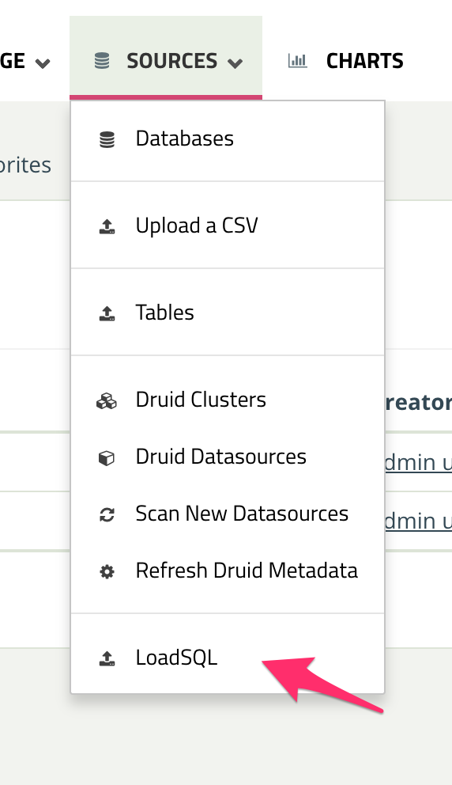

.. _importing_sql:

====================
Importing a SQL file
====================

The dashboard provides an extension to allow the import of SQL files.

.. note::
   This feature is restricted to administrators.

You can access this functionality in the sources menu, under `LoadSQL`

There you can specify a `Database Name` and a `SQL file` to be loaded.

After submitting, a new database will be created, and the SQL file will be
executed in it.

.. warning::
   This is a destructive procedure, and there is no way to ensure that the
   SQL file is safe to execute in the live environment and won't have
   unintended consequences.

   It is the responsibility of the administrator creating the DB to ensure
   the safety of the SQL script.
