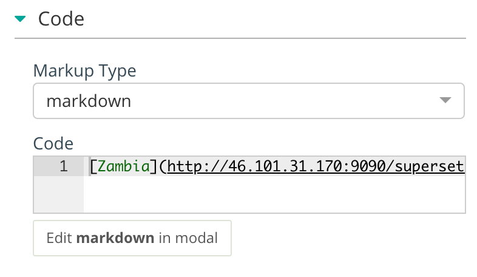

.. _linking_dashboards:

==================
Linking Dashboards
==================

You can include links to sub dashboards inside a dashboard.

To do this, when creating a chart, choose any datasource and then
choose `Markup` as visualization type.

Once the chart is created, select markdown as the `Markup Type` and include
the code link in `markdown syntax`_

.. _markdown syntax: https://daringfireball.net/projects/markdown/syntax#link
