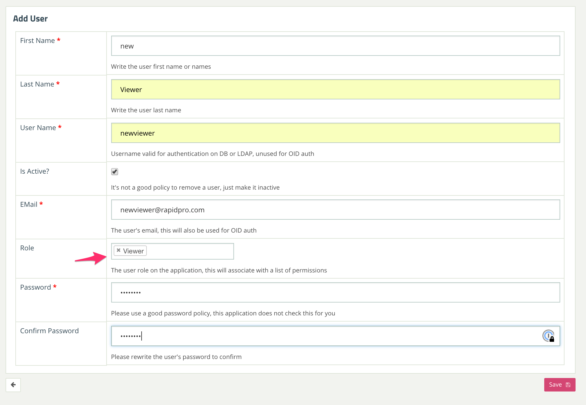

.. _managing_viewers:

================
Managing Viewers
================

The dasbhoad provides an extension for Editors to manage Viewers.

.. note::
   For information on how the permissions are setup see
   :ref:`permission_overview` .

To create and edit viewers you can go to the `Manage viewers` section:

.. warning::
   At the moment there is a bug that requires at least one viewer to exist in
    the system for this intarface to work. Please ask a user with Admin
    priviledges to create a user before using this view.

   This bug should be fixed in the near future.

There you need to provide the user information while making sure you select
the `Viewer` role:

